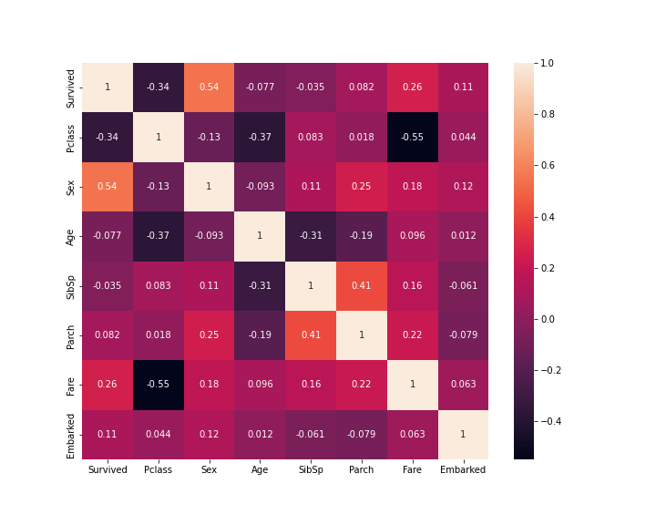

# kaggle-titanic
Main repository for titanic competition on kaggle

- result (2022-07-12)
    - Score : 0.77511
    - Rank  : 8483/15062

## Timeline

## Overview
### The challenge
タイタニック号の沈没は、歴史上最も悪名高い沈没事故の一つである。

1912年4月15日、処女航海中に「不沈船」と言われたRMSタイタニック号は氷山に衝突し沈没した。不幸にも、救命ボートが乗客全員分なく、乗客・乗員2224人のうち1502人が死亡した。

生存には運の要素もありましたが、ある集団は他の集団より生き残る可能性が高かったようです。

この課題では、この問いに答える予測モデルを構築することを求めます。「乗客のデータ（名前、年齢、性別、社会経済階級など）を使って、「どのような人々がより生き残りやすいか？

### The data
このコンペティションでは、名前、年齢、性別、社会経済階級などの乗客情報を含む2つの類似したデータセットにアクセスすることができます。1つのデータセットは `train.csv` というタイトルで、もう1つは `test.csv` というタイトルである。

Train.csvには乗客のサブセット（正確には891人）の詳細が含まれ、重要なのは彼らが生存しているかどうか、また「真実の証拠」として知られていることが明らかになることである。

test.csv`データセットには同様の情報が含まれているが、各乗客の "ground truth "は開示されない。これらの結果を予測するのはあなたの仕事である。

train.csvのデータで見つけたパターンを使って、（test.csvで見つけた）他の乗客418人が生き延びたかどうかを予測しなさい。

データ」タブで、データセットをさらに詳しく調べてみてください。競争力のあるモデルを作成したと感じたら、Kaggle に提出して、あなたのモデルが他の Kaggler に対してどのような地位にあるのかを確認します。

## Data dictionary

| Variable | Definition | Key |
| ---- | ---- | ---- |
| Survival | 生死 | 0=No, 1=Yes |
| Pclass | チケットクラス | 1=1st, 2=2nd, 3=3rd |
| Sex | 性別 | |
| Age | 年齢 | |
| SibSp | 兄弟/夫婦の人数 | |
| Parch | 両親/子供の人数 | |
| Ticket | チケット番号 | |
| Fare | 旅客運賃 | |
| Cabin | 客室番号 | |
| Embarked | 乗船港 | C=Cherbourg, Q=Queenstown, S=Southampton |

## Log

### 20220712
- Joined this competition.
- Applied Random Forest Classifier as indicated in the [tutorial](https://www.kaggle.com/code/alexisbcook/titanic-tutorial/notebook).
    - See `./nb/nb00.ipynb`
    - Basic idea was based on the fact that "female" tends to alive rather than "male".
    - Score: 0.77511

### 20220713
- Applied 2-layer MLP
- Score: 0.77272
    - See `./nb/nb01.ipynb`
    - Input feature was same as previous try `["Pclass", "Sex", "SibSp", "Parch"]`.
    - Just concatenated each dummy vector to get 5-dimensional vector.
- This simple design proved additional feature engineerings are required...

>**Warning**
>Debug for CUDA devise-side error which become clear due to lacking of sigmoid function before `nn.BCELoss()`.

>**Note**
>Additionally experimented 5-layer MLP but score was 0.77511 (the same as the first trial!). See `./nb/nb02.ipynb`.

### 20220713 - 2
- Conducting explanatory data analysis suggested by [this](https://atmarkit.itmedia.co.jp/ait/articles/2112/10/news043.html) article.
- Calculated a cross correlation between each column.

- This figure gave insights that `Sex` and `Fare` information have positive relationships with `Survived` as well as negative one with `Pclass`.

### 20220714
- Submitted a new test estimate only based on `Sex` information
- Scored 0.76555
- This simple assumption came from the categorical plot between `Sex` and `Survived` in the `train.csv`.

## Idea list
Summarizing assorted ideas here.
- Split train/validation data to find best epoch
    - this can also be used for getting optimal threshold for binary classification.
- Ensembling several models
- Explanatory Data Analysis (EDA)
